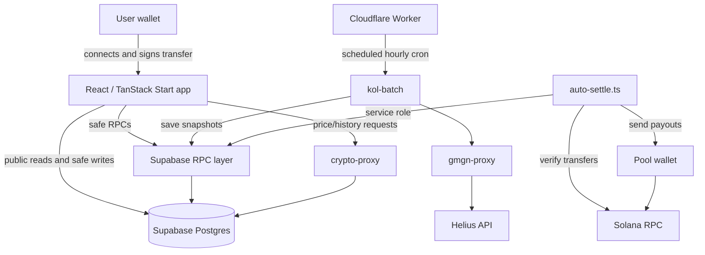
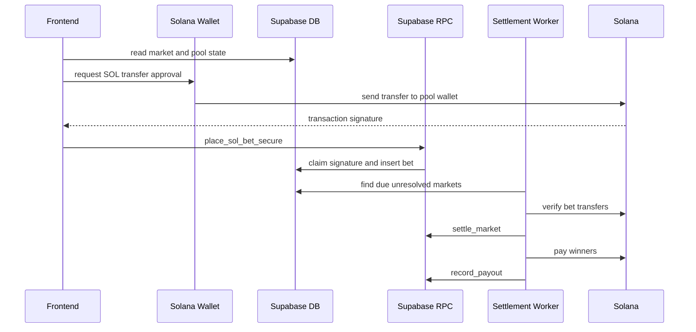
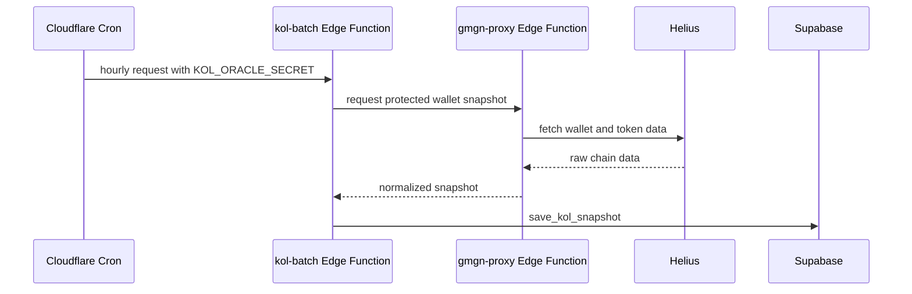

# ARENA

<p align="center">
  
</p>

<p align="center">
  <strong>Bet on results. Not on hype.</strong>
</p>

<p align="center">
  ARENA is a Solana prediction market for crypto price outcomes and tracked trader performance.
</p>

<p align="center">
  <a href="#overview">Overview</a>
  ·
  <a href="#architecture">Architecture</a>
  ·
  <a href="#market-lifecycle">Market Lifecycle</a>
  ·
  <a href="#configuration">Configuration</a>
  ·
  <a href="#deployment">Deployment</a>
  ·
  <a href="supabase/README.md">Supabase Docs</a>
</p>

---

## Overview

ARENA is a crypto-native prediction market where users stake SOL on clear, time-bound outcomes.

The product is intentionally simple from the user's side: connect a wallet, pick a market, choose YES or NO, send a SOL stake, and wait for settlement. If the selected side wins, the user receives their original stake plus a proportional share of the losing side's pool.

The platform currently focuses on two market families:

| Market type | What users predict | Settlement source |
| --- | --- | --- |
| Crypto markets | Whether an asset reaches or finishes around a price condition. | Crypto price data through the backend price proxy and settlement worker. |
| KOL markets | Whether a tracked wallet performs against a defined condition. | Hourly KOL snapshots collected by the oracle flow. |

There is no platform token, no custodial account balance, and no deposit screen. Participation is wallet based: every SOL bet starts with a user-approved transaction.

## Product Surface

| Area | Route | Purpose |
| --- | --- | --- |
| Home | `/` | Product entry point, live stats, active market highlights. |
| Crypto markets | `/cryptomarkets` | Open crypto prediction markets. |
| KOL markets | `/kolmarkets` | Markets tied to tracked trader wallets. |
| Market detail | `/market/:marketId` | YES/NO pools, bet flow, chart/context, market state. |
| Portfolio | `/portfolio` | Bets for the connected wallet and payout status. |
| Leaderboard | `/leaderboard` | Aggregated platform/player performance. |
| Closed markets | `/closed-markets` | Resolved market history. |
| Docs | `/docs` | User-facing explanation of mechanics, risks, and settlement. |
| How it works | `/howitworks` | Friendly product explanation. |

## Features

| Feature | Description |
| --- | --- |
| Wallet-first betting | Users connect a Solana wallet and approve each SOL transfer themselves. |
| YES/NO pools | Each market has two sides. Winners split the losing side's liquidity proportionally. |
| Crypto markets | Price-based outcomes for assets such as BTC, ETH, SOL, DOGE, and others. |
| KOL markets | Markets backed by tracked on-chain trader wallet snapshots. |
| Live updates | Market boards, pool totals, portfolio, and leaderboards stay fresh without heavy table reads. |
| Automatic settlement | A backend worker resolves due markets and records payouts. |
| Portfolio tracking | Connected users can see open bets, resolved bets, and payout state. |
| Leaderboards | Database-side aggregation avoids downloading large historical bet sets. |

## Architecture

ARENA is split into four main pieces:

- the React/TanStack frontend
- Supabase Postgres, RLS, RPCs, and Edge Functions
- a Cloudflare Worker runtime with scheduled cron
- Solana RPC and the pool wallet settlement flow



## Data Flow



## Market Lifecycle

| Step | Actor | What happens |
| --- | --- | --- |
| 1 | User or app | A market is created with a question, duration, asset/condition, and close time. |
| 2 | User | A wallet connects and chooses YES or NO. |
| 3 | Wallet | The user approves a SOL transfer to the pool wallet. |
| 4 | Supabase RPC | `place_sol_bet_secure` records the bet and protects against tx signature replay. |
| 5 | Frontend | Market pools update through efficient reads and realtime refreshes. |
| 6 | Settlement worker | Due markets are resolved using the correct settlement source. |
| 7 | Solana | Winner payouts are sent from the pool wallet. |
| 8 | Supabase RPC | Payout transactions and final state are recorded. |

Payouts are proportional:

```txt
winner payout = original stake + proportional share of the losing pool
```

## KOL Snapshot Flow

KOL markets depend on hourly wallet snapshots. The first snapshot gives the current balance/state. PnL becomes meaningful once a previous hourly snapshot exists.



Only the backend should call Helius. The public frontend should never be able to burn the Helius quota directly.

## Tech Stack

| Area | Technology |
| --- | --- |
| App framework | React 19, TanStack Start, TanStack Router |
| Data fetching/state | TanStack Query, custom live hooks |
| Styling | Tailwind CSS |
| UI primitives | Radix UI, lucide-react |
| Charts | Lightweight Charts, Recharts |
| Database | Supabase Postgres |
| Backend API | Supabase RPCs and Edge Functions |
| Hosting/runtime | Cloudflare Workers |
| Scheduled jobs | Cloudflare Cron Triggers |
| Chain | Solana Web3.js |
| Scripts | TypeScript through `tsx` |
| Build | Vite |

## Project Structure

```text
.
├── src/
│   ├── components/           # reusable UI, market cards, boards, wallet UI
│   ├── hooks/                # live market data, stats, realtime and polling logic
│   ├── integrations/         # Supabase clients and auth helpers
│   ├── lib/                  # platform utilities, price service, Solana pool helpers
│   ├── routes/               # TanStack route pages
│   └── server.ts             # Cloudflare Worker entry and scheduled handler
├── supabase/
│   ├── functions/            # Edge Functions: crypto-proxy, gmgn-proxy, kol-batch
│   ├── migrations/           # database migrations, RPCs, RLS, grants
│   ├── schema/               # readable schema snapshot
│   └── README.md             # detailed Supabase backend documentation
├── scripts/                  # build/security helpers
├── auto-settle.ts            # settlement worker
├── verify-pool.ts            # pool wallet helper
└── package.json              # scripts and dependencies
```

## Supabase Backend

The Supabase layer is documented in detail here:

```text
supabase/README.md
```

At a high level, Supabase contains:

| Layer | Responsibility |
| --- | --- |
| Tables | Markets, bets, users, KOL wallets, snapshots, and replay protection. |
| RLS and grants | Public reads where needed, protected writes for sensitive operations. |
| RPCs | Safe frontend calls and service-only settlement calls. |
| Edge Functions | Crypto price proxy, protected KOL proxy, hourly KOL batch worker. |
| Migrations | Complete database history from initial tables through runtime role grants. |

## Configuration

Create a local `.env` file for development and scripts. Keep it private.

Do not paste real values into GitHub, commits, issues, screenshots, or README files.

### Public browser/runtime values

These can exist in deployment config or `.env` because they are intended for browser/runtime use:

```bash
VITE_SUPABASE_PROJECT_ID=your_project_ref
VITE_SUPABASE_URL=https://your_project_ref.supabase.co
VITE_SUPABASE_PUBLISHABLE_KEY=your_publishable_or_anon_key
VITE_SOLANA_PUBLIC_RPC_URL=https://your_public_rpc_url
VITE_SOLANA_POOL_PUBLIC_KEY=your_pool_public_key
```

### Private local/script values

These must stay private:

```bash
SUPABASE_URL=https://your_project_ref.supabase.co
SUPABASE_SERVICE_ROLE_KEY=your_service_role_key
SOLANA_RPC_URL=your_rpc_url
SOLANA_POOL_PRIVATE_KEY=your_pool_private_key
KOL_ORACLE_SECRET=your_oracle_secret
HELIUS_API_KEY=your_helius_key
```

### Platform secrets

| Platform | Secret | Why |
| --- | --- | --- |
| Supabase Edge Functions | `SERVICE_ROLE_KEY` | Allows Edge Functions to call protected RPCs. |
| Supabase Edge Functions | `HELIUS_API_KEY` | Allows protected KOL wallet reads. |
| Supabase Edge Functions | `KOL_ORACLE_SECRET` | Authenticates oracle/batch calls. |
| Cloudflare Workers | `KOL_ORACLE_SECRET` | Lets scheduled cron call `kol-batch`. |

## Run Locally

Install dependencies:

```bash
npm install
```

Start the app:

```bash
npm run dev
```

Run tests:

```bash
npm run test
```

Run linting:

```bash
npm run lint
```

Build production assets:

```bash
npm run build
```

Preview the production build:

```bash
npm run preview
```

Run the settlement worker once:

```bash
npm run auto-settle:once
```

Run the continuous settlement worker:

```bash
npm run auto-settle
```

## Deployment

### 1. Push database migrations

```bash
npx supabase link --project-ref your_project_ref
npx supabase db push
```

### 2. Deploy Supabase Edge Functions

```bash
npx supabase functions deploy crypto-proxy
npx supabase functions deploy gmgn-proxy
npx supabase functions deploy kol-batch
```

### 3. Configure secrets

```bash
npx supabase secrets set SERVICE_ROLE_KEY="..."
npx supabase secrets set HELIUS_API_KEY="..."
npx supabase secrets set KOL_ORACLE_SECRET="..."
npx wrangler secret put KOL_ORACLE_SECRET
```

### 4. Build and deploy Cloudflare Worker

```bash
npm run build
npx wrangler deploy
```

The Worker also contains the scheduled handler for the hourly KOL batch:

```jsonc
"triggers": {
  "crons": ["0 * * * *"]
}
```

## Available Scripts

| Command | Description |
| --- | --- |
| `npm run dev` | Start local development with Vite. |
| `npm run build` | Build production assets and scrub generated build secrets. |
| `npm run build:dev` | Build in development mode. |
| `npm run preview` | Preview the production build locally. |
| `npm run test` | Run TypeScript tests with `tsx --test`. |
| `npm run lint` | Run ESLint. |
| `npm run format` | Format the project with Prettier. |
| `npm run auto-settle` | Run the continuous settlement worker. |
| `npm run auto-settle:once` | Run one settlement pass and exit. |

## Security Model

| Area | Rule |
| --- | --- |
| Browser | Uses publishable Supabase keys only. No service role, no private wallet key. |
| Betting | User signs a Solana transfer before a bet is recorded. |
| Replay protection | Transaction signatures are claimed so they cannot be reused for duplicate bets. |
| Settlement | Runs server-side with service role and pool wallet access. |
| KOL oracle | Protected by `KOL_ORACLE_SECRET`; public users cannot trigger unlimited Helius calls. |
| Build output | `npm run build` runs a scrub script to remove generated secret artifacts. |
| Git | `.env`, Wrangler state, build output, and local-only artifacts should stay ignored. |

Before pushing:

```bash
git status
git diff --cached --name-only
```

If a secret is ever committed or pushed, rotate it immediately. Removing it from Git after the fact is not enough if someone may already have seen it.

## Troubleshooting

| Symptom | Likely cause | Fix |
| --- | --- | --- |
| App cannot connect to Supabase | Wrong `VITE_SUPABASE_URL` or publishable key. | Check `.env` and deployment vars. |
| `auto-settle.ts` gets table permission errors | New Supabase project missing latest grants. | Run `npx supabase db push` and confirm migration 25 applied. |
| KOL leaderboard has balances but no PnL | Only one hourly snapshot exists. | Wait for the next hourly cron run. |
| `gmgn-proxy` returns unauthorized | Missing or mismatched `KOL_ORACLE_SECRET`. | Set the same secret in Supabase and Cloudflare. |
| Helius usage grows too quickly | Duplicate cron or exposed proxy access. | Keep only one KOL cron enabled and keep `gmgn-proxy` protected. |
| Build warns about chunk size | Some app bundles are large. | Consider route-level dynamic imports if this becomes a real performance issue. |

## Documentation Map

| Document | Use it for |
| --- | --- |
| `README.md` | Product overview, architecture, local setup, deployment. |
| `supabase/README.md` | Database schema, migrations, RPCs, Edge Functions, backend operations. |
| `src/routes/docs.tsx` | User-facing product documentation inside the app. |

## Disclaimer

ARENA is experimental software. Prediction markets involve financial risk, and users can lose their entire stake. Nothing in this repository is financial advice.
