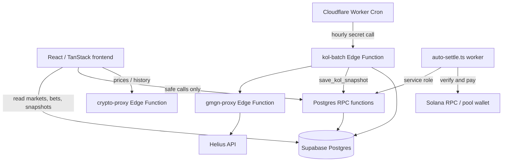
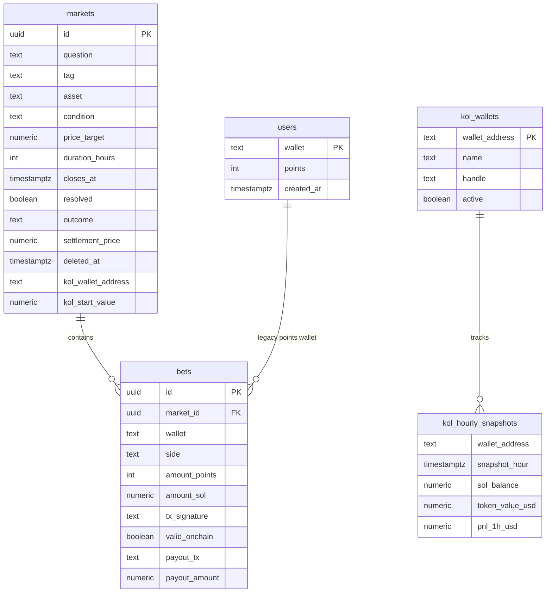
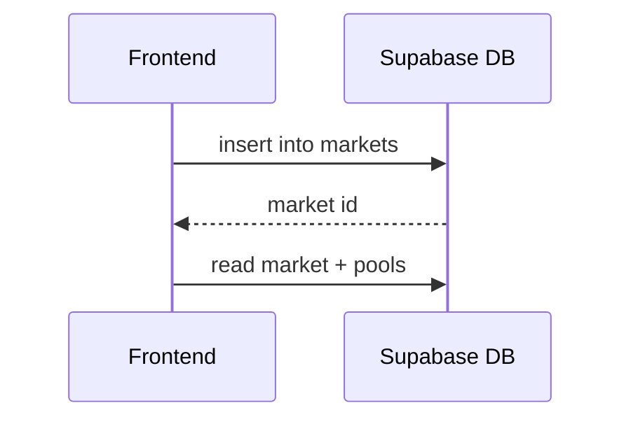
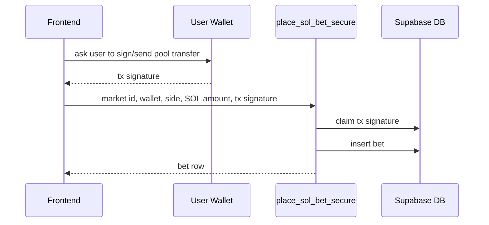
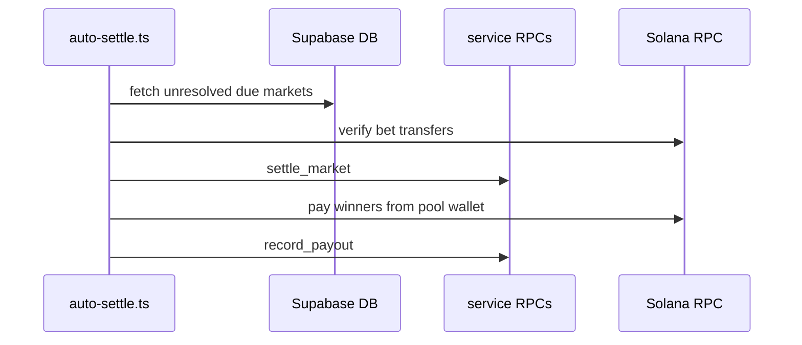
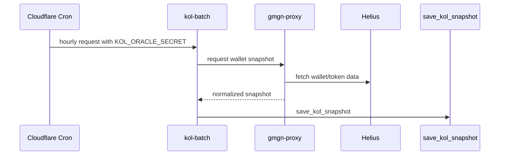

# ArenaBets Supabase Backend

This folder documents the database, RPC layer, Edge Functions, and operational setup used by ArenaBets.

It is written for a real developer coming back to the project later: what exists, why it exists, what is safe to run, and what should not be touched lightly.

## What Supabase Does Here

Supabase is the backend for:

- prediction markets
- YES/NO bets
- wallet portfolios
- market pools
- crypto price cache support
- KOL hourly snapshots
- KOL market settlement data
- leaderboard aggregation
- protected RPCs used by the settlement worker

The frontend should stay simple: it reads public market data, calls safe RPCs, and never receives service-role credentials.

## Folder Map

```text
supabase/
├── README.md                 # this file
├── config.toml               # Supabase CLI project configuration
├── migrations/               # source of truth for database changes
├── functions/
│   ├── crypto-proxy/         # cached crypto prices/history
│   ├── gmgn-proxy/           # protected KOL/Helius data proxy
│   └── kol-batch/            # hourly KOL snapshot worker
├── schema/
│   └── current.sql           # readable schema snapshot, not a prod reset script
└── scripts/                  # manual SQL helpers and maintenance scripts
```

## Big Picture



## Core Tables



| Table | Purpose | Frontend access |
| --- | --- | --- |
| `markets` | Main market records, including crypto and KOL market metadata. | Public read, controlled insert. Updates go through service RPCs. |
| `bets` | YES/NO bets, SOL amount, transaction signature, verification and payout fields. | Public read. Inserts should go through `place_sol_bet_secure`. |
| `users` | Legacy points wallet records. | Public read, points RPCs still exist for legacy/dev flows. |
| `prices_cache` | Optional cached crypto price data. | Public read, service writes. |
| `kol_wallets` | Registry of tracked KOL wallets. | Public read. |
| `kol_hourly_snapshots` | Hourly KOL balance/token/PnL snapshots. | Public read. Written by service RPC only. |
| `bet_tx_signature_claims` | Replay protection for Solana bet signatures. | Hidden. |

## RPC Layer

The database exposes a few safe RPCs to the frontend and keeps privileged operations behind `service_role`.

| RPC | Used by | Access | Notes |
| --- | --- | --- | --- |
| `place_sol_bet_secure` | Market pages | `anon`, `authenticated` | Records a SOL bet only after validating shape and claiming the tx signature. |
| `get_market_pools` | Market page, portfolio, boards | public | Returns YES/NO pool totals for requested market ids without downloading every bet. |
| `get_leaderboard_stats` | Leaderboard page | public | Aggregates leaderboard stats inside Postgres to reduce egress. |
| `ensure_user` | Legacy points flow | public | Creates a points account if missing. |
| `place_points_bet` | Legacy/dev points flow | public | Keeps old points betting available. |
| `settle_market` | settlement worker | `service_role` | Resolves a market outcome and settlement price. |
| `record_payout` | settlement worker | `service_role` | Stores payout tx and amount after payment. |
| `save_kol_snapshot` | `kol-batch` | `service_role` | Inserts hourly KOL snapshots. First write for an hour is frozen. |
| `generate_market_snapshot` | service flows | `service_role` | Freezes market pool state for settlement/history. |

## Edge Functions

| Function | Purpose | Secret requirements |
| --- | --- | --- |
| `crypto-proxy` | Fetches and caches crypto prices/history for the app. | Usually no private API key required. |
| `gmgn-proxy` | Reads KOL wallet data through Helius. Public abuse is blocked. | `HELIUS_API_KEY`, `KOL_ORACLE_SECRET`, `SERVICE_ROLE_KEY`. |
| `kol-batch` | Runs the hourly KOL snapshot loop and KOL market settlement checks. | `KOL_ORACLE_SECRET`, `SERVICE_ROLE_KEY`. |

`gmgn-proxy` is intentionally protected. The frontend should not be able to trigger unlimited Helius calls.

## Main Runtime Flows

### Create a market



Market creation is public but constrained by database checks and policies. Settlement fields are not supposed to be changed directly by users.

### Place a SOL bet



The database records the bet, but the settlement worker later verifies the transaction on-chain before paying out.

### Auto settlement



`auto-settle.ts` must use the service role and the pool wallet key. Do not expose either one to the frontend.

### KOL snapshots



PnL needs at least two hourly snapshots. Right after a new Supabase migration, seeing balances before PnL is normal.

## Cron Setup

The current preferred setup is Cloudflare Cron, configured in the Worker deployment settings:

```jsonc
"triggers": {
  "crons": ["0 * * * *"]
}
```

That means the Worker wakes up once per hour and calls the KOL batch flow.

There are also SQL scripts for Supabase-side cron, but do not run Cloudflare cron and Supabase cron for the same KOL job at the same time. That would duplicate Helius usage and could create duplicate work.

## Secrets

Never commit real secrets.

### Local `.env`

Used for local dev, builds, and scripts:

```bash
VITE_SUPABASE_PROJECT_ID=your_project_ref
VITE_SUPABASE_URL=https://your_project_ref.supabase.co
VITE_SUPABASE_PUBLISHABLE_KEY=your_publishable_or_anon_key

SUPABASE_URL=https://your_project_ref.supabase.co
SUPABASE_SERVICE_ROLE_KEY=your_service_role_key

SOLANA_RPC_URL=your_rpc_url
SOLANA_POOL_PRIVATE_KEY=your_pool_private_key
VITE_SOLANA_POOL_PUBLIC_KEY=your_pool_public_key
```

### Supabase Edge Function secrets

Set these with the Supabase CLI or the dashboard:

```bash
npx supabase secrets set SERVICE_ROLE_KEY="..."
npx supabase secrets set HELIUS_API_KEY="..."
npx supabase secrets set KOL_ORACLE_SECRET="..."
```

Supabase CLI rejects custom secrets that start with `SUPABASE_`; that is expected. Use `SERVICE_ROLE_KEY` for Edge Functions.

### Cloudflare Worker secrets

The Worker needs the same KOL oracle secret so it can call `kol-batch`:

```bash
npx wrangler secret put KOL_ORACLE_SECRET
```

Cloudflare deployment config should contain public `VITE_*` values only. Never put the service role key there.

## Deployment Commands

Link the CLI to the project:

```bash
npx supabase link --project-ref your_project_ref
```

Push database migrations:

```bash
npx supabase db push
```

Deploy Edge Functions:

```bash
npx supabase functions deploy crypto-proxy
npx supabase functions deploy gmgn-proxy
npx supabase functions deploy kol-batch
```

Build and deploy the app/Worker:

```bash
npm run build
npx wrangler deploy
```

Run settlement once locally:

```bash
npx tsx auto-settle.ts --once
```

Run the continuous settlement worker locally:

```bash
npx tsx auto-settle.ts
```

## Migration Timeline

| # | File | What it adds |
| --- | --- | --- |
| 01 | `01_initial_tables.sql` | Initial `markets` and `bets` tables with basic RLS. |
| 02 | `02_crypto_markets.sql` | Structured crypto market fields and early crypto settlement RPC. |
| 03 | `03_points_system.sql` | Legacy points users and points betting RPCs. |
| 04 | `04_market_payouts.sql` | Pool-style point payout logic. |
| 05 | `05_expanded_crypto_assets.sql` | Expanded supported assets and constraints. |
| 06 | `06_track_payouts.sql` | Payout tracking fields on bets. |
| 07 | `07_prices_cache.sql` | Price cache table and cleanup helper. |
| 08 | `08_market_snapshots.sql` | Market snapshot generation and snapshot settlement. |
| 09 | `09_backfill_snapshots.sql` | Backfills snapshots for existing markets. |
| 10 | `10_market_soft_delete.sql` | Market maintenance metadata, rate limit and audit tables. |
| 11 | `11_kol_hourly_snapshots.sql` | KOL hourly snapshot table. |
| 12 | `12_kol_wallets_and_market_params.sql` | KOL wallet registry and KOL market fields. |
| 13 | `13_hard_delete_market.sql` | Maintenance cleanup RPC. |
| 15 | `15_kol_snapshot_rpc.sql` | RPC for saving KOL snapshots. |
| 16 | `16_settle_market_rpc.sql` | Generic service settlement and payout RPCs. |
| 17 | `17_get_market_pools_rpc.sql` | Efficient pool totals by market id. |
| 18 | `18_security_critical_hardening.sql` | Locks privileged RPCs behind service role and adds secure SOL bet flow. |
| 19 | `19_revoke_public_execute_on_privileged_rpcs.sql` | Extra revoke/grant cleanup for privileged functions. |
| 20 | `20_replay_oracle_secret_hardening.sql` | Bet tx signature replay protection and stricter RPC permissions. |
| 21 | `21_defer_bet_tx_signature_claims_fk.sql` | Defers signature claim relation for safer insert flow. |
| 22 | `22_freeze_kol_snapshot_first_write.sql` | Prevents rewriting an hourly KOL snapshot once saved. |
| 23 | `23_leaderboard_stats_rpc.sql` | Database-side leaderboard aggregation. |
| 24 | `24_runtime_role_table_grants.sql` | Runtime grants for anon/authenticated/service roles. |

## Security Notes

- The service role bypasses RLS, so treat it like a production root key.
- `.env`, `.wrangler`, and generated build output must stay out of Git.
- Public clients can read public market data, but privileged actions should go through locked RPCs.
- KOL/Helius access is protected behind Edge Function secrets to prevent public quota abuse.
- Privileged maintenance actions are audited and rate limited.
- If a service key, Helius key, pool key, or oracle secret is ever pasted publicly, rotate it.

## Troubleshooting

| Symptom | Likely cause | Fix |
| --- | --- | --- |
| `permission denied for table markets` from `auto-settle.ts` | Runtime grants missing on the new project. | Run `npx supabase db push` and make sure migration 25 is applied. |
| Supabase CLI says `Env name cannot start with SUPABASE_` | Supabase reserves that prefix for Edge Function runtime vars. | Store `SERVICE_ROLE_KEY`, not `SUPABASE_SERVICE_ROLE_KEY`, as an Edge Function secret. |
| KOL leaderboard shows balance but no PnL | Only one snapshot exists so far. | Wait for the next hourly cron run. |
| `gmgn-proxy` returns unauthorized | Missing or mismatched `KOL_ORACLE_SECRET`. | Set the same secret in Supabase and Cloudflare. |
| Helius usage suddenly spikes | Duplicate cron or public proxy abuse. | Make sure only one cron system is enabled and `gmgn-proxy` stays protected. |
| New Supabase project has schema but empty data | Migrations create structure, not old production rows. | Import data separately only if you actually need old markets/bets. |

## Safe Mental Model

Use migrations as the source of truth.

Use `schema/current.sql` as a readable snapshot.

Use service-role scripts only from trusted environments.

Use Cloudflare cron for the hourly KOL job unless you intentionally switch to Supabase cron.

Keep the frontend experience stable by optimizing reads with RPCs instead of downloading whole tables.
